# Projeto `Untitled City Game`.

# Descrição
O `Untitled City Game` é um jogo de construção de cidades em que o jogador deve assumir o papel de um prefeito e organizar sua cidade de modo a fazer com que ela prospere e que sua população fique satisfeita. Portanto, o jogo tem como próposito fazer com o que o jogador entenda como planejar de maneira eficiente e criativa o arranjo de construções da cidade fazendo com que ela progrida de acordo com as regras de jogo. 

# Equipe
* `Riccardo Carvalho Sofer - RA 247362`
* `Pedro Carvalho Cintra - RA 247315`

# Arquivo executável do jogo

[jar](src/desktop/build/libs)

# Para jogar...
Para jogar basta baixar o arquivo [jar](src/desktop/build/libs) e, em um terminal, navegar até o diretório o qual o arquivo jar está e digitar o seguinte comando: 
java -jar desktop-1.0.jar

# Slides do projeto
[Link Slides](https://docs.google.com/presentation/d/1TJfkO0ycISbAXsCrqyaSoHrUhCPaGAkyrBRW4GFfrWY/edit?usp=sharing)

# Mecânica do Jogo 
Descrever (detalhadamente) mecânicas do jogo

# Diagramas
## Diagrama geral de Arquitetura do Jogo

## Diagrama geral de Componentes  

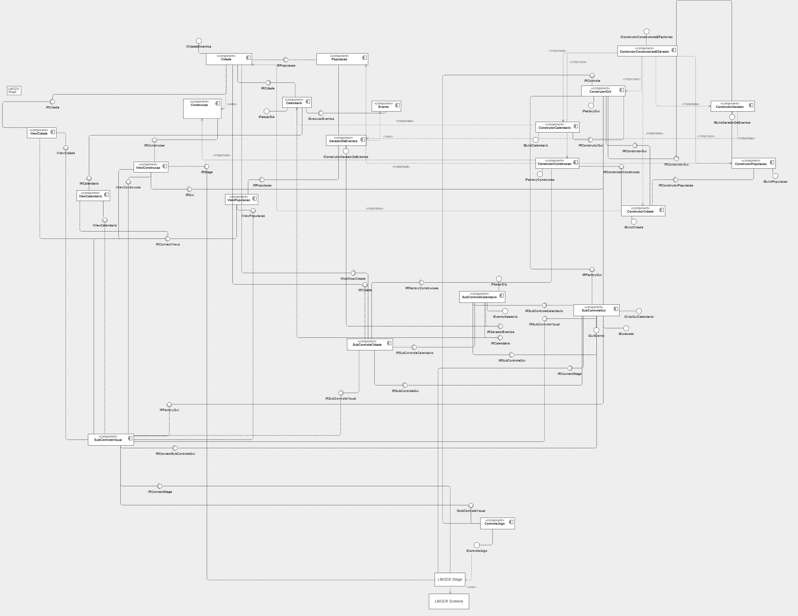

## Componente `Cidade`
Componente que contem o layout de construcoes 

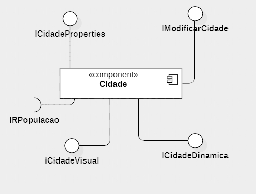

**Ficha Técnica**
item | detalhamento
----- | -----
Classe | Cidade: `com.projeto.game.model.cidade`
Autores | Riccardo Carvalho Sofer e Pedro Carvalho Cintra
Interfaces | `ICidade, ICidadeVisual, IRPopulacao, ICidadeProperties, IModificarCidade, ICidadeDinamica `

### interfaces 
> interfaces associadas a esse componente

> interface agregador do componente em java
~~~java
public interface ICidade extends ICidadeVisual, IRPopulacao, ICidadeProperties, IModificarCidade, ICidadeDinamica {
}
~~~

### Detalhamento das interfaces

#### Interface `ICidadeVisual`
Interface responsável pela criação visual da cidade e do dinheiro.

~~~java
package com.projeto.game.model.cidade;
…
public interface ICidadeVisual {
	public Table criarCidadeVisual();
	public Group criarDinheiroVisual();
}
~~~

Método | Objetivo
-------| --------
`criarCidadeVisual` | método que cria uma Table, configura suas dimensões e a retorna.
`criarDinheiroVisual` | método que cria um Group que contém o ícone e o texto referentes ao dinheiro e o retorna.

#### Interface `IRPopulacao`
Interface responsável por conectar populacao na cidade.

~~~java
package com.projeto.game.model.cidade;
…
public interface IRPopulacao {
    public void connectPopulacao(IPopulacao populacao);
}
~~~

Método | Objetivo
-------| --------
`connectPopulacao` | método que recebe a interface IPopulacao como parâmetro e a conecta com a cidade.

#### Interface `ICidadeProperties`
Interface responsável pelos métodos relacionados as propriedades da cidade.

~~~java

package com.projeto.game.model.cidade;
…
public interface ICidadeProperties {
	public float getDinheiro();
	public IConstrucao[][] getLayout();
	public void setLayout(IConstrucao[][] layout);
	public IPopulacao getPopulacao();
	public void setDinheiro(float dinheiro);
	public void setLabel(Label label);
	public Label getLabel();
	public float getRenda();
	public void setRenda(float renda);
}
~~~

Método | Objetivo
-------| --------
`getDinheiro` | método que retorna o dinheiro da cidade.
`getLayout` | método que retorna o layout da cidade.
`setLayout` | método que recebe como parâmetro uma matriz de IConstrucao e a defini no atributo layout da cidade.
`getPopulacao` | método que retorna a populacao da cidade.
`setDinheiro` | método que recebe como parâmetro um float e o defini no atributo dinheiro da cidade.
`setLabel` | método que recbe como parâmetro um Label e o defini no atributo label da cidade.
`getLabel` | método que retorna o label da cidade.
`getRenda` | método que retorna a renda da cidade.
`setRenda` | método que recebe como parâmetro um float e o defini no atributo renda da cidade.

#### Interface `IModificarCidade`
Interface responsável pela adição e remoção de construcao na cidade.

~~~java
package com.projeto.game.model.cidade;
…
public interface IModificarCidade {
	public void adicionarConstrucao(IConstrucao construcao);
	public void removerConstrucao(int linha, int coluna);
}
~~~

Método | Objetivo
-------| --------
`adicionaConstrucao` | método que realiza a construção de uma nova construcao na cidade, realizando as alterações necessárias na cidade.
`removerConstrucao` | método que realiza a demolição de uma construcao na cidade, realizando as alterações necessárias na cidade.

#### Interface `ICidadeDinamica`
Interface responsável pelas interações com a cidade.

~~~java
package com.projeto.game.model.cidade;
…
public interface ICidadeDinamica {
	public int numMoradiasVizinhas(IConstrucao construcao);
	public void interacoesMoradiaConstruiu(IConstrucao construcao);
	public int acharDecrescimos(IConstrucao moradia);
	public void interacoesMoradiaPassouDia();
	public void passarDia();
}
~~~

Método | Objetivo
-------| --------
`numMoradiasVizinhas` | método que recebe como parâmetro uma IConstrucao e retorna a quantidade de construções do tipo Moradia ao redor.
`interacoesMoradiaConstruiu` | método que realiza a interação, nesse caso a possível adição de satisfacao da populacao,apos uma construcao ser construída.
`acharDecrescimos` | método que recebe como parâmetro uma IConstrucao do tipo Moradia e retorna a quantidade de decrèscimos, nesse caso a quantidade de construções do tipo Industria.
`interacoesMoradiaPassouDia` | método que passa por todas as contruções do tipo Moradia e realiza os decrésimos de satisfacao da populacao.
`passarDia` | método que realiza os efeitos na cidade ao passar o dia.

## Componente `construcao`
Componente que

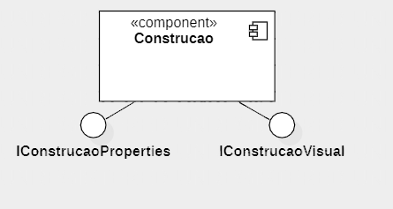

**Ficha Técnica**
item | detalhamento
----- | -----
Classe | Construcao: `com.projeto.game.model.construcao` (abstract class)
Subclasses (Construcao) | Escola, Moradia, Mercado, Industria, Prefeitura, Hospital e Vazio 
Autores | Riccardo Carvalho Sofer e Pedro Carvalho Cintra
Interfaces | `IConstrucao, IConstrucaoProperties, IConstrucaoVisual`

### interfaces 
> interfaces associadas a esse componente

> interface agregador do componente em java
~~~java
package com.projeto.game.model.construcao;

public interface IConstrucao extends IConstrucaoProperties, IConstrucaoVisual {
}
~~~

### Detalhamento das interfaces

#### Interface `IConstrucaoProperties`
Interface responsável pelos métodos relacionados as propriedades da construcao.

~~~java
package com.projeto.game.model.construcao;
…
public interface IConstrucaoProperties {
    public int getLinha();
    public void setLinha(int linha);

    public int getColuna();
    public void setColuna(int coluna);
    
    public float getPreco();
    public void setPreco(float preco);
    
    public int getSatisfacao();
    public void setSatisfacao(int satisfacao);
    
    public float getRenda();
    public void setRenda(float renda);
    
    public boolean getConstruido();
    public void setConstruido(boolean estado);
    
    public Button getBotao();
    public void setBotao(Button botao);
    
    public Window getJanela();
    public void setJanela(Window janela);
    
    public abstract String getTipo();
    public abstract int getTempoConstrucao();
}
~~~

Método | Objetivo
-------| --------
`getLinha` | método que retorna a posição da linha da construcao.
`setLinha` | método que recebe como parâmetro um int e o defini no atributo linha da construcao.
`getColuna` | método que retorna a posição da coluna da construcao.
`setColuna` | método que recebe como parâmetro um int e o defini no atributo coluna da construcao.
`getPreco` | método que retorna o preco da construcao.
`setPreco` | método que recebe como parâmetro um float e o defini no atributo preco da construcao.
`getSatisfacao` |  método que retorna a satisfacao associada à construcao.
`setSatisfacao` | método que recebe como parâmetro um int e o defini no atributo satisfacao da construcao.
`getRenda` |  método que retorna a reanda da construcao.
`setRenda` | método que recebe como parâmetro um float e o defini no atributo renda da construcao.
`getConstruido` |  método que retorna a estado estado construido da construcao .
`setConstruido` | método que recebe como parâmetro um boolean e o defini no atributo construido da construcao.
`getBotao` |  método que retorna o botão associado à construcao.
`setBotao` | método que recebe como parâmetro um Button e o defini no atributo botao da construcao.
`getJanela` |  método que retorna a janela associada à construcao.
`setJanela` | método que recebe como parâmetro uma Window e a defini no atributo janela da construcao.
`getTipo` |  método (abstract) que retorna uma String representando o tipo da construcao.
`getTempoConstrucao` |  método (abstract) que retorna o tempo para construir a construcao.

#### Interface `IConstrucaoVisual`
Interface responsável pela criação visual das construções.

~~~java
package com.projeto.game.model.construcao;
…
public interface IConstrucaoVisual {
	public Group criarConstrucaoVisual();
}
~~~

Método | Objetivo
-------| --------
`criarConstrucaoVisual` | método que cria um Group que contém .

## Componente `calendario`
Componente que

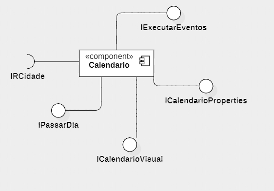

**Ficha Técnica**
item | detalhamento
----- | -----
Classe | Construcao: `com.projeto.game.model.calendario` 
Autores | Riccardo Carvalho Sofer e Pedro Carvalho Cintra
Interfaces | `ICalendario, IRCidade, IPassarDia, ICalendarioVisual, IExecutarEventos, `

### interfaces 
> interfaces associadas a esse componente

> interface agregador do componente em java
~~~java
package com.projeto.game.model.calendario;

public interface ICalendario extends IRCidade, IPassarDia, ICalendarioVisual, IExecutarEventos, ICalendarioProperties {
}
~~~

### Detalhamento das interfaces

#### Interface `IRCidade`
Interface responsável por conectar a cidade no calendario.

~~~java
package com.projeto.game.model.calendario;
…
public interface IRCidade {
	public void connectCidade(ICidade cidade);
}
~~~

Método | Objetivo
-------| --------
`connectCidade` | método que recebe a interface ICidade como parâmetro e a conecta com o calendario.

#### Interface `IPassarDia`
Interface responsável por passar o dia e acionar as modificações ao passar o dia.

~~~java
package com.projeto.game.model.calendario;

public interface IPassarDia {
	public void passarDia();
}
~~~

Método | Objetivo
-------| --------
`passarDia` | método que realiza a alteração do dia do calendario, pede para que cidade realiza as modificações necessárias ao passar o dia e aciona a execução de eventos.

#### Interface `ICalendarioVisual`
Interface responsável pela criação visual do calendario.

~~~java
package com.projeto.game.model.calendario;
…
public interface ICalendarioVisual {
	public Group criarCalendarioVisual();
}
~~~

Método | Objetivo
-------| --------
`criarCalendarioVisual` | método .

#### Interface `IExecutarEventos`
Interface responsável por adicionar e executar os eventos do calendário.

~~~java
package com.projeto.game.model.calendario;
…
public interface IExecutarEventos {
	public void addEvento(IEvento evento);
	public void executarEventos();
}
~~~

Método | Objetivo
-------| --------
`addEvento` | método que adiciona eventos a lista de eventos.
`executarEventos` | método percorre a lista de eventos e aciona a execução dos eventos do dia.

#### Interface `ICalendarioProperties`
Interface responsável pelos métodos relacionados as propriedades do calendario.

~~~java
package com.projeto.game.model.calendario;
…
public interface ICalendarioProperties {
	public int getData();
    public void setLabel(Label label);
    public Label getLabel();
}
~~~

Método | Objetivo
-------| --------
`getData` | método que retorna a diaAtual do calendario.
`setLabel` | método que recebe como parâmetro uma Label e o defini no atributo texto da construcao.
`getLabel` | método que retorna o texto do calendario.

## Componente `gerador`
Componente que

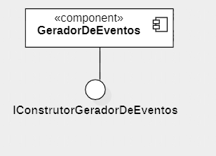

**Ficha Técnica**
item | detalhamento
----- | -----
Classes | ConstrutorGeradorDeEventos : `com.projeto.game.model.gerador`; GeradorEventoAleatorio : `com.projeto.game.model.gerador`; GeradorEventoConstrucao  : `com.projeto.game.model.gerador`
Autores | Riccardo Carvalho Sofer e Pedro Carvalho Cintra
Interfaces | `IConstrutorGeradorDeEventos, IGerarEventoAleatorio, IGerarEventoConstrucao`

### interfaces 
> interfaces associadas a esse componente

### Detalhamento das interfaces

#### Interface `IConstrutorGeradorDeEventos`
Interface responsável por acionar a criarção de eventos.

~~~java
package com.projeto.game.model.gerador;
…
public interface IConstrutorGeradorDeEventos {
	public IEvento criarEventoAleatorio(int data);
    public IEvento criarEventoConstrucao(IConstrucao construcao, int data);
}
~~~

Método | Objetivo
-------| --------
`criarEventoAleatorio` | método que aciona a geração de um evento aleatorio.
`criarEventoConstrucao` | método que aciona a geração de um evento construcao.

#### Interface `IGerarEventoAleatorio`
Interface responsável por gerar e definir o evento aleatorio.

~~~java
package com.projeto.game.model.gerador;
…
public interface IGerarEventoAleatorio{
    public EventoAleatorio gerarEventoAleatorio(int data);

}
~~~

Método | Objetivo
-------| --------
`gerarEventoAleatorio` | método que cria e defini um novo evento aleatorio.

#### Interface `IGerarEventoAleatorio`
Interface responsável por gerar e definir o evento construcao.

~~~java
package com.projeto.game.model.gerador;
…
public interface IGerarEventoConstrucao {
    public EventoConstrucao gerarEventoConstrucao(IConstrucao construcao, int data);
}
~~~

Método | Objetivo
-------| --------
`gerarEventoConstrucao` | método que cria e defini um novo evento construcao.

## Componente `Evento`
Componente que

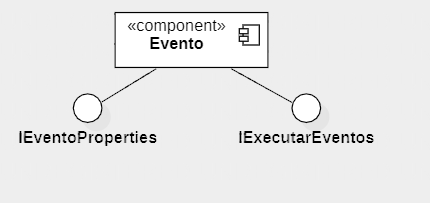

**Ficha Técnica**
item | detalhamento
----- | -----
Classe | Evento: `com.projeto.game.model.evento` (abstract class)
Subclasses (Evento) | EventoAleatorio e EventoConstrucao 
Autores | Riccardo Carvalho Sofer e Pedro Carvalho Cintra
Interfaces | `IEvento, IEventoProperties, IExecutarEvento `

### interfaces 
> interfaces associadas a esse componente

> interface agregador do componente em java
~~~java
package com.projeto.game.model.evento;

public interface IEvento extends IEventoProperties, IExecutarEvento{
}
~~~

### Detalhamento das interfaces

#### Interface `IEventoProperties`
Interface responsável pelos métodos relacionados as propriedades do evento.

~~~java
package com.projeto.game.model.evento;

public interface IEventoProperties {
	public String getDescricao();
	public void setDescricao(String descricao);
	public void setData(int data);
	public int getData();
}
~~~

Método | Objetivo
-------| --------
`getDescricao` | método que retorna a descricao do evento.
`setDescricao` | método que recebe como parâmetro uma String e a defini no atributo descricao da construcao.
`setData` | método que recebe como parâmetro um int e o defini no atributo data da construcao.
`getData` | método que retorna a data do evento.

#### Interface `IExecutarEvento`
Interface responsável pela execução do evento.

~~~java
package com.projeto.game.model.evento;
…
public interface IExecutarEvento {
	public void executarEvento(ICidade cidade);
}
~~~

Método | Objetivo
-------| --------
`executarEvento` | método (abstract) que realiza a execução de cada evento. No caso de um EventoAleatorio aciona o strategy, enquanto que, para o EventoConstrucao, altera o estado construido da construcao.

## Componente `Populacao`
Componente que

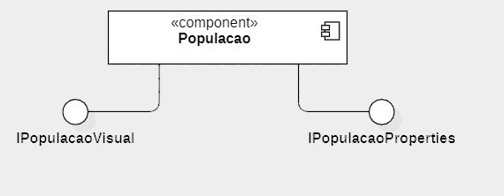

**Ficha Técnica**
item | detalhamento
----- | -----
Classe | Populacao: `com.projeto.game.model.evento` 
Autores | Riccardo Carvalho Sofer e Pedro Carvalho Cintra
Interfaces | `IPopulacao, IPopulacaoProperties, IPopulacaoVisual`

### interfaces 
> interfaces associadas a esse componente

> interface agregador do componente em java
~~~java
package com.projeto.game.model.populacao;

public interface IPopulacao extends IPopulacaoProperties, IPopulacaoVisual {

}
~~~

### Detalhamento das interfaces

#### Interface `IPopulacaoProperties`
Interface responsável pelos métodos relacionados as propriedades da populacao.

~~~java
package com.projeto.game.model.populacao;
…
public interface IPopulacaoProperties {
    public int getNumHabitantes();
    public int getSatisfacao();
    public double getRendaPopulacao();
    
    public void setLabelSatisfacao(Label label);
    public Label getLabelSatisfacao();
    
    public void setLabelPopulacao(Label label);
    public Label getLabelPopulacao();
    
    public void addPopulacao(int num);
    public void addRenda(double num);
    public void addSatisfacao(int num);
}
~~~

Método | Objetivo
-------| --------
`getNumHabitantes` | método que retorna o numHabitantes da populacao.
`getSatisfacao` | método que retorna a satisfacao da populacao.
`getRendaPopulacao` | método que retorna a rendaPopulacao da populacao.
`setLabelSatisfacao` | método que recebe como parâmetro uma Label e a defini no atributo textoSatisfacao da populacao.
`getLabelSatisfacao` | método que retorna o textoSatisfacao da populacao.
`setLabelPopulacao` | método que recebe como parâmetro uma Label e a defini no atributo textoPopulacao da populacao.
`getLabelPopulacao` | método que retorna o textoPopulacao da populacao.
`addPopulacao` | método que recebe como parâmetro um int e o adiciona ao valor do numHabitantes da populacao.
`addRenda` | método que recebe como parâmetro um float e o adiciona ao valor do rendaPopulacao da populacao.
`addSatisfacao` | método que recebe como parâmetro um int e o adiciona ao valor do satisfacao da populacao.

#### Interface `IPopulacaoVisual`
Interface responsável 

~~~java
package com.projeto.game.model.populacao;
…
public interface IPopulacaoVisual {
	public Group criarSatisfacaoVisual();
	public Group criarPopulacaoVisual();
}
~~~

Método | Objetivo
-------| --------
`criarSatisfacaoVisual` | método que.
`criarPopulacaoVisual` | método que.

## Componente `construtorCalendario`
Componente que

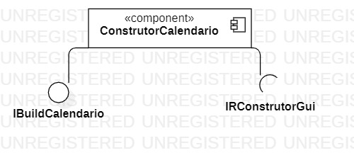

**Ficha Técnica**
item | detalhamento
----- | -----
Classe | ConstrutorCalendario: `com.projeto.game.controller.construtor.calendario` 
Autores | Riccardo Carvalho Sofer e Pedro Carvalho Cintra
Interfaces | `IConstrutorCalendario, IBuildCalendario, IRConstrutorGui`

### interfaces 
> interfaces associadas a esse componente

> interface agregador do componente em java
~~~java
package com.projeto.game.controller.construtor.calendario;

public interface IConstrutorCalendario extends IBuildCalendario, IRConstrutorGui {

}
~~~

### Detalhamento das interfaces

#### Interface `IBuildCalendario`
Interface responsável pela criação do calendario.

~~~java
package com.projeto.game.controller.construtor.calendario;
…
public interface IBuildCalendario {
	public ICalendario buildCalendario();
}
~~~

Método | Objetivo
-------| --------
`buildCalendario` | método que instancia o calendario e defini seu atributo texto.

#### Interface `IRConstrutorGui`
Interface responsável por conectar o construtorGui no construtorCalendario .

~~~java
package com.projeto.game.controller.construtor.calendario;
…
public interface IRConstrutorGui {
	public void connect(IFactoryGui construtorGui);

}
~~~

Método | Objetivo
-------| --------
`connect` | método que recebe a interface IFactoryGui como parâmetro e a conecta com o construtorCalendario.

## Componente `construtorCidade`
Componente que

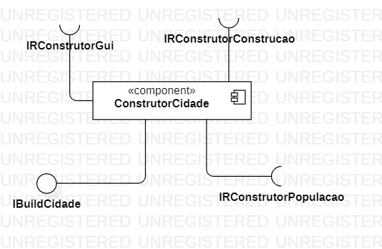

**Ficha Técnica**
item | detalhamento
----- | -----
Classe | ConstrutorCidade: `com.projeto.game.controller.construtor.cidade` 
Autores | Riccardo Carvalho Sofer e Pedro Carvalho Cintra
Interfaces | `IConstrutorCidade, IRConstrutorConstrucao, IRConstrutorGui, IRConstrutorPopulacao, IBuildCidade`

### interfaces 
> interfaces associadas a esse componente

> interface agregador do componente em java
~~~java
package com.projeto.game.controller.construtor.cidade;

public interface IConstrutorCidade extends IRConstrutorConstrucao, IRConstrutorGui, IRConstrutorPopulacao, IBuildCidade {

}
~~~

### Detalhamento das interfaces

#### Interface `IRConstrutorConstrucao`
Interface responsável por conectar o construtorConstrucao no construtorCidade.

~~~java
package com.projeto.game.controller.construtor.cidade;
…
public interface IRConstrutorConstrucao {
	public void connectConstrutorConstrucao(IFactoryConstrucao construtorConstrucao);
}
~~~

Método | Objetivo
-------| --------
`connectConstrutorConstrucao` | método que recebe a interface IFactoryConstrucao como parâmetro e a conecta com o construtorCidade.

#### Interface `IRConstrutorGui`
Interface responsável por conectar o construtorGui no construtorCidade.

~~~java
package com.projeto.game.controller.construtor.cidade;
…
public interface IRConstrutorGui {
	public void connectConstrutorGui(IFactoryGui construtorGui);
}
~~~

Método | Objetivo
-------| --------
`connectConstrutorGui` | método que recebe a interface IFactoryGui como parâmetro e a conecta com o construtorCidade.

#### Interface `IRConstrutorPopulacao`
Interface responsável por conectar o construtorPopulacao no construtorCidade.

~~~java
package com.projeto.game.controller.construtor.cidade;
…
public interface IRConstrutorPopulacao {
	public void connectConstrutorPopulacao(IConstrutorPopulacao construtorPopulacao);
}
~~~

Método | Objetivo
-------| --------
`connectConstrutorPopulacao` | método que recebe a interface IConstrutorPopulacao como parâmetro e a conecta com o construtorCidade.

#### Interface `IBuildCidade`
Interface responsável pela criação da cidade.

~~~java
package com.projeto.game.controller.construtor.cidade;
…
public interface IBuildCidade {
	public ICidade buildCidade();
}
~~~

Método | Objetivo
-------| --------
`buildCidade` | método que instancia a cidade, cria seu layout, conecta a populacao e defini seu dinheiro, seu textoDinheiro e sua renda.

## Componente `construtorConstrucoes`
Componente que

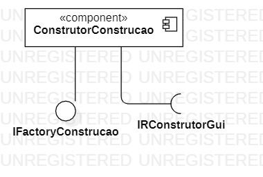

**Ficha Técnica**
item | detalhamento
----- | -----
Classes | ConstrutorConstrucoes: `com.projeto.game.controller.construtor.construcoes`; FactoryConstrucao: `com.projeto.game.controller.construtor.construcoes`
Autores | Riccardo Carvalho Sofer e Pedro Carvalho Cintra
Interfaces | `IFactoryConstrucao, IRConstrutorGui, IBuildConstrucao`

### interfaces 
> interfaces associadas a esse componente

### Detalhamento das interfaces

#### Interface `IFactoryConstrucao`
Interface que extende a interface IRConstrutorGui e é responsável pela criação das contruções, usando o Desing Pattern Factory. 

~~~java
package com.projeto.game.controller.construtor.construcoes;
…
public interface IFactoryConstrucao extends IRConstrutorGui {
	public IConstrucao criarConstrucao(String tipo, int linha, int coluna);
}
~~~

Método | Objetivo
-------| --------
`criarConstrucao` | método que fabrica e retorna uma contrucao.

#### Interface `IRConstrutorGui`
Interface responsável por conectar o construtorGui no construtorConstrucoes.

~~~java
package com.projeto.game.controller.construtor.construcoes;
…
public interface IRConstrutorGui {
	public void connect(IFactoryGui fabrica);
}
~~~

Método | Objetivo
-------| --------
`connect` |  método que recebe a interface IFactoryGui como parâmetro e a conecta com o construtorConstrucoes.

#### Interface `IBuildConstrucao`
Interface responsável pela criação das construções.

~~~java
package com.projeto.game.controller.construtor.construcoes;
…
public interface IBuildConstrucao {
	public Escola buildEscola(int linha, int coluna);
	public Hospital buildHospital(int linha, int coluna);
	public Industria buildIndustria(int linha, int coluna);
	public Mercado buildMercado(int linha, int coluna);
	public Moradia buildMoradia(int linha, int coluna);
	public Prefeitura buildPrefeitura(int linha, int coluna);
	public Vazio buildVazio(int linha, int coluna);
}
~~~

Método | Objetivo
-------| --------
`buildEscola` | método instancia uma Escola e defini sua posição e sua estado construido.
`buildHospital` | método instancia uma Hospital e defini sua posição e sua estado construido.
`buildIndustria` | método instancia uma Industria e defini sua posição e sua estado construido.
`buildMercado` | método instancia uma Mercado e defini sua posição e sua estado construido.
`buildMoradia` | método instancia uma Moradia e defini sua posição e sua estado construido.
`buildPrefeitura` | método instancia uma Prefeitura e defini sua posição e sua estado construido.
`buildVazio` | método instancia uma Vazio e defini sua posição e sua estado construido.

## Componente `construtorGerador`
Componente que

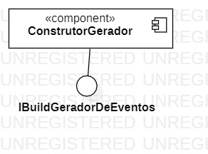

**Ficha Técnica**
item | detalhamento
----- | -----
Classe | ConstrutorConstrutorGeradorDeEventos: `com.projeto.game.controller.construtor.gerador`
Autores | Riccardo Carvalho Sofer e Pedro Carvalho Cintra
Interfaces | `IConstrutorConstrutorGeradorDeEventos, IBuildGeradorDeEventos`

### interfaces 
> interfaces associadas a esse componente

> interface agregador do componente em java
~~~java
package com.projeto.game.controller.construtor.gerador;

public interface IConstrutorConstrutorGeradorDeEventos extends IBuildGeradorDeEventos{
    
}
~~~

### Detalhamento das interfaces

#### Interface `IBuildGeradorDeEventos`
Interface que cria o construtorGeradorDeEventos

~~~java
package com.projeto.game.controller.construtor.gerador;
…
public interface IBuildGeradorDeEventos {
    public IConstrutorGeradorDeEventos buildGeradorDeEventos();
}
~~~

Método | Objetivo
-------| --------
`buildGeradorDeEventos` | método que instancia e retorna o construtorGeradorDeEventos.

## Componente `construtorGui`
Componente que

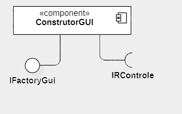

**Ficha Técnica**
item | detalhamento
----- | -----
Classes | FactoryGui: `com.projeto.game.controller.construtor.gui`; ConstrutorBotao: `com.projeto.game.controller.construtor.gui`; ConstrutorDialog: `com.projeto.game.controller.construtor.gui`; ConstrutorJanela: `com.projeto.game.controller.construtor.gui`; ConstrutorLabel: `com.projeto.game.controller.construtor.gui`; 
Autores | Riccardo Carvalho Sofer e Pedro Carvalho Cintra
Interfaces | `IFactoryGui, IRControle, IBuildBotao, IBuildDialog, IBuildJanela, IBuildLabel`

### interfaces 
> interfaces associadas a esse componente

### Detalhamento das interfaces

#### Interface `IFactoryGui`
Interface que extende a interface IRControle e é responsável pela criação de elementos da GUI (graphical user interface), usando o Desing Pattern Factory.

~~~java
package com.projeto.game.controller.construtor.gui;
…
public interface IFactoryGui extends IRControle {
	public Button criarBotao(String tipo, String texto, float largura, float altura, int linha, int coluna);
	public Window criarJanela(String tipo, String titulo, String texto, float largura, float altura, int linha, int coluna);
	public Label criarLabel(String texto, float tamanhoFonte, String estilo);
	public Dialog criarDialog(String titulo, String texto, float tamanhoFonte, float largura, float altura);
}
~~~

Método | Objetivo
-------| --------
`criarBotao` | método que aciona a criação de um Button atraves de do ConstrutorBotao.
`criarJanela` | método que aciona a criação de uma Window atraves de do ConstrutorJanela.
`criarLabel` | método que aciona a criação de uma Label atraves de do ConstrutorLabel.
`criarDialog` | método que aciona a criação de um Dialog atraves de do ConstrutorDialog.

#### Interface `IRControle`
Interface responsável por conectar o subControleCidade no construtorGui.

~~~java
package com.projeto.game.controller.construtor.gui;
…
public interface IRControle {
	public void connect(ISubControleCidade controle);
}
~~~

Método | Objetivo
-------| --------
`connect` | método que recebe a interface ISubControleCidade como parâmetro e a conecta com o construtorGui.

#### Interface `IBuildBotao`
Interface responsável pela criação de botões.

~~~java
package com.projeto.game.controller.construtor.gui;
…
public interface IBuildBotao extends IRControle {
	public Button buildBotaoTexto(String texto, float largura, float altura);
	public Button buildBotaoImagemVazio(float largura, float altura);
	public Button buildBotaoImagem(TextureRegionDrawable image, float largura, float altura, int linha, int coluna, String tipo);
	public Button buildBotaoDestruir(String texto, float largura, float altura, int linha, int coluna, String tipo);

}
~~~

Método | Objetivo
-------| --------
`buildBotaoTexto` | método que instancia um TextButton com o texto fornecido, defini seu tamanho com as dimensões dadas e o retorna.
`buildBotaoImagemVazio` | método que instancia um ImageButton, defini seu tamanho, através dos parâmetros passados, e o retorna.
`buildBotaoImagem` | método que instancia um ImageButton usando um novoEstilo criado a partir do parâmetro TextureRegionDrawable ..., defini seu tamanho e o retorna.
`buildBotaoDestruir` | método que .

#### Interface `IBuildDialog`
Interface responsável pela criação de dialogs

~~~java
package com.projeto.game.controller.construtor.gui;
…
public interface IBuildDialog {
	public Dialog buildDialog(String titulo, float largura, float altura);
}
~~~

Método | Objetivo
-------| --------
`buildDialog` | método que instancia um Dialog com o titulo fornecido, defini seu tamanho com as dimensões dadas e o retorna.

#### Interface `IBuildJanela`
Interface responsável por conectar o subControleCidade no construtorGui.

~~~java
package com.projeto.game.controller.construtor.gui;
…
public interface IBuildJanela {
	public Window buildJanela(String titulo, float largura, float altura);
}
~~~

Método | Objetivo
-------| --------
`buildJanela` | método que instancia uma Window com o titulo fornecido, defini seu tamanho com as dimensões dadas e a retorna.

#### Interface `IBuildLabel`
Interface responsável por conectar o subControleCidade no construtorGui.

~~~java
package com.projeto.game.controller.construtor.gui;
…
public interface IBuildLabel {
	public Label criarLabel(String texto, float tamanhoFonte, String estilo);
}
~~~

Método | Objetivo
-------| --------
`connect` | método que instancia uma Label com o texto fornecido, defini o tamanho e estilo da fonte com as informações dadas e a retorna.

## Componente `construtorPopulacao`
Componente que

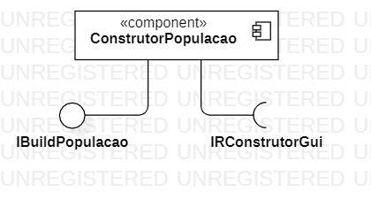

**Ficha Técnica**
item | detalhamento
----- | -----
Classe | ConstrutorPopulacao: `com.projeto.game.controller.construtor.populacao`
Interfaces | `IConstrutorPopulacao, IBuildPopulacao, IRConstrutorGui`

### interfaces 
> interfaces associadas a esse componente

> interface agregador do componente em java
~~~java
package com.projeto.game.controller.construtor.populacao;

public interface IConstrutorPopulacao extends IBuildPopulacao, IRConstrutorGui {

}
~~~

### Detalhamento das interfaces

#### Interface `IBuildPopulacao`
Interface responsável pela criação da populacao.

~~~java
package com.projeto.game.controller.construtor.populacao;
…
public interface IBuildPopulacao {
	public IPopulacao buildPopulacao();
}
~~~

Método | Objetivo
-------| --------
`buildPopulacao` | método que instancia a populacao, defini o textoPopulacao e o textoSatisfacao e a retorna.

#### Interface `IRConstrutorGui`
Interface responsável por conectar o construtorGui no construtorPopulacao.

~~~java
package com.projeto.game.controller.construtor.populacao;
…
public interface IRConstrutorGui {
	public void connect(IFactoryGui construtorGui);
}
~~~

Método | Objetivo
-------| --------
`connect` | método que recebe a interface IFactoryGui como parâmetro e a conecta com o construtorPopulacao.

## Componente `subcontrolesCalendario`
Componente que

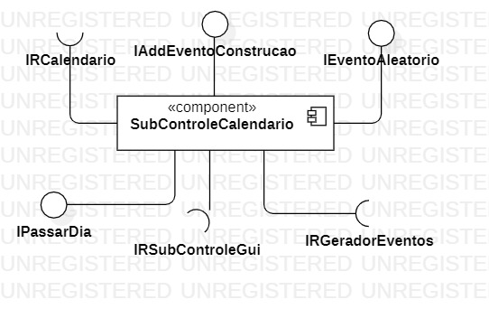

**Ficha Técnica**
item | detalhamento
----- | -----
Classe | SubControleCalendario: `com.projeto.game.controller.controle.subcontroles.calendario`
Interfaces | `ISubControleCalendario, IRSubControleGui, IRGeradorEventos, IRCalendario, IEventoAleatorio, IPassarDia, IAddEventoConstrucao `

### interfaces 
> interfaces associadas a esse componente

> interface agregador do componente em java
~~~java
package com.projeto.game.controller.controle.subcontroles.calendario;

public interface ISubControleCalendario extends IRSubControleGui, IRGeradorEventos, IRCalendario, IEventoAleatorio, IPassarDia, IAddEventoConstrucao {

}
~~~

### Detalhamento das interfaces

#### Interface `IRSubControleGui`
Interface responsável por conectar o subcontrolesGui no subcontrolesCalendario.

~~~java
package com.projeto.game.controller.controle.subcontroles.calendario;
…
public interface IRSubControleGui {
	public void connectSubControleGui(ISubControleGui subControleGui);
}
~~~

Método | Objetivo
-------| --------
`connectSubControleGui` | método que recebe a interface ISubControleGui como parâmetro e a conecta com o subcontrolesCalendario.

#### Interface `IRGeradorEventos`
Interface responsável por conectar o geradorDeEventos no subcontrolesCalendario.

~~~java
package com.projeto.game.controller.controle.subcontroles.calendario;
…
public interface IRGeradorEventos {
	public void connectGeradorEventos(IConstrutorGeradorDeEventos geradorEventos);
}
~~~

Método | Objetivo
-------| --------
`connectGeradorEventos` | método que recebe a interface IConstrutorGeradorDeEventos como parâmetro e a conecta com o subcontrolesCalendario.

#### Interface `IRCalendario`
Interface responsável por conectar o calendario no subcontrolesCalendario.

~~~java
package com.projeto.game.controller.controle.subcontroles.calendario;
…
public interface IRCalendario {
	public void connectCalendario(ICalendario calendario);
}
~~~

Método | Objetivo
-------| --------
`connectCalendario` | método que recebe a interface ICalendario como parâmetro e a conecta com o subcontrolesCalendario.

#### Interface `IEventoAleatorio`
Interface responsável por acionar a criação de um novo evento aleatorio.

~~~java
package com.projeto.game.controller.controle.subcontroles.calendario;

public interface IEventoAleatorio {
	public void eventoAleatorio();
}
~~~

Método | Objetivo
-------| --------
`eventoAleatorio` | método que aciona a geração de um eventoAleatorio, adiciona esse evento no calendario e aciona o subContrleGui para que ele adicione um Dialog para o evento.

#### Interface `IPassarDia`
Interface responsável por acionar a passagem de dia no calendario.

~~~java
package com.projeto.game.controller.controle.subcontroles.calendario;

public interface IPassarDia {
	public void passarDia();
}
~~~

Método | Objetivo
-------| --------
`passarDia` | método que confere se é o calendario está em um dia de geração de evento aleatorio e aciona a passagem de dia no calendario.

#### Interface `IAddEventoConstrucao `
Interface responsável por adicionar um eventoConstrucao no calendario.

~~~java
package com.projeto.game.controller.controle.subcontroles.calendario;
…
public interface IAddEventoConstrucao {
	public void addEventoConstrucao(IConstrucao construcao, int prefeituraConstruida);
}
~~~

Método | Objetivo
-------| --------
`addEventoConstrucao` | método que aciona a criação de um eventoConstrucao da construcao fornecida e adiciona esse evento no calendario.

## Componente `subcontrolesCidade`
Componente que

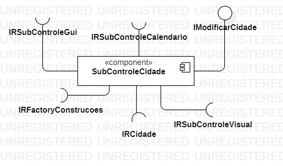

**Ficha Técnica**
item | detalhamento
----- | -----
Classe | SubControleCidade: `com.projeto.game.controller.controle.subcontroles.cidade`
Interfaces | `ISubControleCidade, IRCidade, IRFactoryConstrucoes, IRSubControleCalendario, IRSubControleGui, IRSubControleVisual, IModificarCidade`

### interfaces 
> interfaces associadas a esse componente

> interface agregador do componente em java
~~~java
package com.projeto.game.controller.controle.subcontroles.cidade;

public interface ISubControleCidade extends IRCidade, IRFactoryConstrucoes, IRSubControleCalendario, IRSubControleGui, IRSubControleVisual, IModificarCidade {

}
~~~

### Detalhamento das interfaces

#### Interface `IRCidade`
Interface responsável por conectar a cidade no subcontrolesCidade.

~~~java
package com.projeto.game.controller.controle.subcontroles.cidade;
…
public interface IRCidade {
	public void connectCidade(ICidade cidade);
}
~~~

Método | Objetivo
-------| --------
`connectCidade` | método que recebe a interface ICidade como parâmetro e a conecta com o subcontrolesCidade.

#### Interface `IRFactoryConstrucoes`
Interface responsável por conectar a FactoryConstrucao no subcontrolesCidade.

~~~java
package com.projeto.game.controller.controle.subcontroles.cidade;
…
public interface IRFactoryConstrucoes {
	public void connectFactoryConstrucoes(IFactoryConstrucao factory);
}
~~~

Método | Objetivo
-------| --------
`connectFactoryConstrucoes` | método que recebe a interface IFactoryConstrucao como parâmetro e a conecta com o subcontrolesCidade.

#### Interface `IRSubControleCalendario`
Interface responsável por conectar o SubControleCalendario no subcontrolesCidade.

~~~java
package com.projeto.game.controller.controle.subcontroles.cidade;
…
public interface IRSubControleCalendario {
	public void connectSubControleCalendario(ISubControleCalendario subControleCalendario);
}
~~~

Método | Objetivo
-------| --------
`connectSubControleCalendario` | método que recebe a interface ISubControleCalendario como parâmetro e a conecta com o subcontrolesCidade.

#### Interface `IRSubControleGui`
Interface responsável por conectar o SubContrleGui no subcontrolesCidade.

~~~java
package com.projeto.game.controller.controle.subcontroles.cidade;
…
public interface IRSubControleGui  {
	public void connectSubControleVisual (ISubControleGui subControleGui);
}
~~~

Método | Objetivo
-------| --------
`connectSubControleVisual ` | método que recebe a interface ISubControleGui como parâmetro e a conecta com o subcontrolesCidade.

#### Interface `IRSubControleVisual`
Interface responsável por conectar o SubContrleVizual no subcontrolesCidade.

~~~java
package com.projeto.game.controller.controle.subcontroles.cidade;
…
public interface IRSubControleVisual   {
	public void connectSubControleVisual (ISubControleVisual subControleVisual);
}
~~~

Método | Objetivo
-------| --------
`connectSubControleVisual ` | método que recebe a interface ISubControleVisual como parâmetro e a conecta com o subcontrolesCidade.

#### Interface `IModificarCidade`
Interface responsável por acionar a criação e destruição de uma construcao.

~~~java
package com.projeto.game.controller.controle.subcontroles.cidade;

public interface IModificarCidade {
    public void construirConstrucao(String tipo, int linha, int coluna);
    public void removerConstrucao(int linha, int coluna);
}
~~~

Método | Objetivo
-------| --------
`construirConstrucao ` | método que aciona a criação de uma construcao fornecendo à fabrica os parametros recebidos.
`removerConstrucao ` | método que aciona a remoção de uma cidade fornecendo a cidade os parametros recebidos.

## Componente `subcontrolesGui`
Componente que

**Ficha Técnica**
item | detalhamento
----- | -----
Classe | SubControleGui: `com.projeto.game.controller.controle.subcontroles.gui`
Interfaces | `ISubControleGui, IRSubControleVisual, IRFactoryGui, IRConnectStage, IRSubControleCalendario, ICriarGuiCalendario, IGuiEvento, IExcecoes`

### interfaces 
> interfaces associadas a esse componente

> interface agregador do componente em java
~~~java
package com.projeto.game.controller.controle.subcontroles.gui;

public interface ISubControleGui extends IRSubControleVisual, IRFactoryGui, IRConnectStage, IRSubControleCalendario, ICriarGuiCalendario, IGuiEvento, IExcecoes {

}
~~~

### Detalhamento das interfaces

#### Interface `IRSubControleVisual`
Interface responsável por conectar o SubControleVisual no subcontrolesGui.

~~~java
package com.projeto.game.controller.controle.subcontroles.gui;
…
public interface IRSubControleVisual {
	public void connectSubControleVisual(ISubControleVisual subControleVisual);
}
~~~

Método | Objetivo
-------| --------
`connectSubControleVisual` | método que recebe a interface ICidade como parâmetro e a conecta com o subcontrolesGui.

#### Interface `IRFactoryGui`
Interface responsável por conectar a FactoryGui no subcontrolesGui.

~~~java
package com.projeto.game.controller.controle.subcontroles.gui;
…
public interface IRFactoryGui  {
	public void connectFactoryGui(IFactoryGui factory);
}
~~~

Método | Objetivo
-------| --------
`connectFactoryGui` | método que recebe a interface IFactoryGui como parâmetro e a conecta com o subcontrolesGui.

#### Interface `IRConnectStage`
Interface responsável por conectar o stage no subcontrolesGui.

~~~java
package com.projeto.game.controller.controle.subcontroles.gui;
…
public interface IRConnectStage {
	public void connectStage(Stage stage);
}
~~~

Método | Objetivo
-------| --------
`connectStage` | método que recebe a interface Stage como parâmetro e a conecta com o subcontrolesGui.

#### Interface `IRSubControleCalendario`
Interface responsável por conectar o stage no subcontrolesGui.

~~~java
package com.projeto.game.controller.controle.subcontroles.gui;
…
public interface IRSubControleCalendario {
	public void connectSubControleCalendario(ISubControleCalendario subControleCalendario);
}
~~~

Método | Objetivo
-------| --------
`connectSubControleCalendario` | método que recebe a interface ISubControleCalendario como parâmetro e a conecta com o subcontrolesGui.

#### Interface `ICriarGuiCalendario`
Interface responsável pelo vizual do botao passarDia.

~~~java
package com.projeto.game.controller.controle.subcontroles.gui;
…
public interface ICriarGuiCalendario {
	public Button adicionarBotaoPassarDia();
}
~~~

Método | Objetivo
-------| --------
`adicionarBotaoPassarDia` | método que aciona a criação de um botao passarDia por meio da do construtorGui e o retorna.

#### Interface `IGuiEvento`
Interface responsável pela vizualização dos eventos aleatorios.

~~~java
package com.projeto.game.controller.controle.subcontroles.gui;
…
public interface IGuiEvento {
	public void adicionarDialogoEvento(IEvento eventoAleatorio);
}
~~~

Método | Objetivo
-------| --------
`adicionarDialogoEvento` | método que cria e mostra um Dialog de acordo com o eventoAleatorio fornecido no parâmetro.

#### Interface `IExcecoes`
Interface responsável pela vizualização das execoes encontradas.

~~~java
package com.projeto.game.controller.controle.subcontroles.gui;

public interface IExcecoes {
	public void adicionarDialogoExcecao(String error);
}
~~~

Método | Objetivo
-------| --------
`adicionarDialogoExcecao` | método que cria e mostra um Dialog com o erro fornecido no parâmetro.

## Componente `subcontrolesVisual`
Componente que

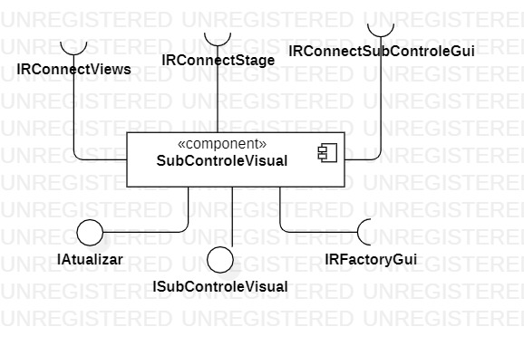

**Ficha Técnica**
item | detalhamento
----- | -----
Classe | SubControleVisual: `com.projeto.game.controller.controle.subcontroles.visual`
Interfaces | `ISubControleVisual, IRFactoryGui, IRConnectStage, IRConnectSubControleGui, IRConnectViews, IAtualizar`

### interfaces 
> interfaces associadas a esse componente

> interface agregador do componente em java
~~~java
package com.projeto.game.controller.controle.subcontroles.visual;

public interface ISubControleVisual extends IRFactoryGui, IRConnectStage, IRConnectSubControleGui, IRConnectViews, IAtualizar {
	…
}
~~~

### Detalhamento das interfaces

#### Interface `IRFactoryGui`
Interface responsável por conectar a FactoryGui no subcontrolesVisual.

~~~java
package com.projeto.game.controller.controle.subcontroles.visual;
…
public interface IRFactoryGui {
	public void connectFactoryGui(IFactoryGui factory);

}
~~~

Método | Objetivo
-------| --------
`connectFactoryGui` | método que recebe a interface IFactoryGui como parâmetro e a conecta com o subcontrolesVisual.

#### Interface `IRConnectStage`
Interface responsável por conectar o satge no subcontrolesVisual.

~~~java
package com.projeto.game.controller.controle.subcontroles.visual;
…
public interface IRConnectStage {
	public void connectStage(Stage stage);
}
~~~

Método | Objetivo
-------| --------
`connectStage` | método que recebe a interface Stage como parâmetro e a conecta com o subcontrolesVisual.

#### Interface `IRConnectSubControleGui`
Interface responsável por conectar o SubContrleGui no subcontrolesVisual.

~~~java
package com.projeto.game.controller.controle.subcontroles.visual;
…
public interface IRConnectSubControleGui {
	public void connectSubControleGui(ISubControleGui subControleGui);
}
~~~

Método | Objetivo
-------| --------
`connectSubControleGui` | método que recebe a interface ISubControleGui como parâmetro e a conecta com o subcontrolesVisual.

#### Interface `IRConnectViews`
Interface responsável por conectar o viewCidade, o viewPopulacao e o viewCalendario no subcontrolesVisual.

~~~java
package com.projeto.game.controller.controle.subcontroles.visual;
…
public interface IRConnectViews {
	public void connectViewCidade(IViewCidade viewCidade);
	public void connectViewPopulacao(IViewPopulacao viewPopulacao);
	public void connectViewCalendario(IViewCalendario viewCalendario);
}
~~~

Método | Objetivo
-------| --------
`connectViewCidade` | método que recebe a interface IViewCidade como parâmetro e a conecta com o subcontrolesVisual.
`connectViewPopulacao` | método que recebe a interface IViewPopulacao como parâmetro e a conecta com o subcontrolesVisual.
`connectViewCalendario` | método que recebe a interface IViewCalendario como parâmetro e a conecta com o subcontrolesVisual.

#### Interface `IAtualizar`
Interface responsável por atualizar a tela de jogo.

~~~java
package com.projeto.game.controller.controle.subcontroles.visual;

public interface IAtualizar {
	public void atualizar();
    public void atualizarVisualCidade();
    public void atualizarVisualPopulacao();
    public void atualizarVisualCalendario();
}
~~~

Método | Objetivo
-------| --------
`atualizar` | método que aciona a atuzalização da cidade, da populacao e do calendario.
`atualizarVisualCidade` | método que atualiza a cidade na tela de jogo.
`atualizarVisualPopulacao` | método que atualiza a populacao na tela de jogo.
`atualizarVisualCalendario` | método que atualiza a calendario na tela de jogo.

## Componente `viewCalendario`
Componente que

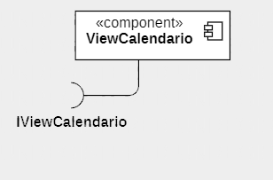

**Ficha Técnica**
item | detalhamento
----- | -----
Classe | ViewCalendario: `com.projeto.game.view.calendario`
Interfaces | `IViewCalendario, IRCalendario`

### interfaces 
> interfaces associadas a esse componente

> interface agregador do componente em java
~~~java
package com.projeto.game.view.calendario;
…
public interface IViewCalendario extends IRCalendario {
	public Group getVisual();

}
~~~

### Detalhamento das interfaces

#### Interface `IRCalendario`
Interface responsável por conectar o calendario no viewCalendario.

~~~java
package com.projeto.game.view.calendario;
…
public interface IRCalendario {
	public void connect(ICalendario calendario);
}
~~~

Método | Objetivo
-------| --------
`connect` | método que recebe a interface ICalendario como parâmetro e o conecta com o viewCalendario.

## Componente `viewCidade`
Componente que

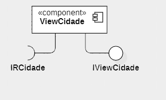

**Ficha Técnica**
item | detalhamento
----- | -----
Classe | ViewCidade: `com.projeto.game.view.cidade`
Interfaces | ` IViewCidade, IRCidade`

### interfaces 
> interfaces associadas a esse componente

> interface agregador do componente em java
~~~java
package com.projeto.game.view.cidade;
…
public interface IViewCidade extends IRCidade {
	…
}
~~~

### Detalhamento das interfaces

#### Interface `IRCidade`
Interface responsável por conectar a cidade no viewCidade.

~~~java
package com.projeto.game.view.cidade;
…
public interface IRCidade {
	public void connectCidade(ICidade cidade);
}
~~~

Método | Objetivo
-------| --------
`connectCidade` | método que recebe a interface ICidade como parâmetro e a conecta com o viewCidade.

## Componente `viewConstrucao`
Componente que

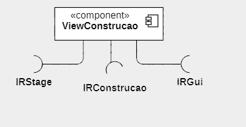

**Ficha Técnica**
item | detalhamento
----- | -----
Classe | ViewConstrucao: `com.projeto.game.view.construcao`
Interfaces | `IViewConstrucao, IRConstrucao, IRStage, IRGui`

### interfaces 
> interfaces associadas a esse componente

> interface agregador do componente em java
~~~java
package com.projeto.game.view.construcao;
…
public interface IViewConstrucao extends IRConstrucao, IRStage, IRGui {
	…
}
~~~

### Detalhamento das interfaces

#### Interface `IRConstrucao`
Interface responsável por conectar a construcao no viewConstrucao.

~~~java
package com.projeto.game.view.construcao;
…
public interface IRConstrucao {
	public void connect(IConstrucao construcao);
}
~~~

Método | Objetivo
-------| --------
`connect` | método que recebe a interface IConstrucao como parâmetro e a conecta com o viewConstrucao.

#### Interface `IRStage`
Interface responsável por conectar o stage no viewConstrucao.

~~~java
package com.projeto.game.view.construcao;
…
public interface IRStage {
	public void connectStage(Stage stage);
}
~~~

Método | Objetivo
-------| --------
`connectStage` | método que recebe a interface Stage como parâmetro e a conecta com o viewConstrucao.

#### Interface `IRGui`
Interface responsável por conectar a FactorGui no viewConstrucao.

~~~java
package com.projeto.game.view.construcao;
…
public interface IRGui {
	public void connectGui(IFactoryGui factoryGui);
}
~~~

Método | Objetivo
-------| --------
`connectGui` | método que recebe a interface IFactoryGui como parâmetro e a conecta com o viewConstrucao.

## Componente `viewPopulacao`
Componente que

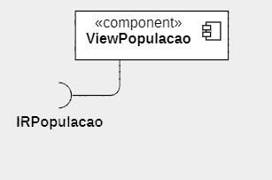

**Ficha Técnica**
item | detalhamento
----- | -----
Classe | ViewPopulacao: `com.projeto.game.view.populacao`
Interfaces | `IViewPopulacao, IRPopulacao`

### interfaces 
> interfaces associadas a esse componente

> interface agregador do componente em java
~~~java
package com.projeto.game.view.populacao;
…
public interface IViewPopulacao extends IRPopulacao {
	…
}
~~~

### Detalhamento das interfaces

#### Interface `IRPopulacao`
Interface responsável por conectar a populacao no viewConstrucao.

~~~java
package com.projeto.game.view.populacao;
…
public interface IRPopulacao {
	public void connect(IPopulacao populacao);
}
~~~

Método | Objetivo
-------| --------
`connect` | método que recebe a interface IPopulacao como parâmetro e a conecta com o viewPopulacao.

# Destaques de códgigo
Trechos relevantes do código

~~~java
// Recorte do seu código
public void algoInteressante(…) {
   …
   trechoInteressante = 100;
}
~~~

# Destaques de Orientação a Objetos
Conceitos de OO utilizados no códgigo (sobrecarga de métodos, polimorfismo ...)

## Diagrama de Classes usada no destaque

## Código do Destaque

~~~java
// Recorte do código do destaque OO
public void algoInteressante(…) {
   …
   trechoInteressante = 100;
}
~~~

# Destaques de Pattern
Foi adotado pela equipe, essencialmente, os seguintes Desing Patterns:
* Singleton
* Factory
* Strategy

## Desing Pattern 1: Singleton
O Pattern Singleton foi utilizado no projeto para gerar mais coesão ao código e evitar que determinados objetos sejam instanciados mais de uma vez. O padrão foi utilizado inúmeras vezes no código estando presente em quase todos os componentes. Não possui esse Pattern apenas componentes e classes que precisam ser instanciadas mais de uma vez (Componente `construcao` e Componente `eventos`)... 

### Diagrama do Pattern 1

### Exemplo de Código do Pattern 1
Esse exemplo representa o uso do Singleton no projeto, no caso do exemplo, para o instanciação da Populacao, seguindo o mesmo padrão para o restante do código.

1. O trecho de código foi retirado do Componente `populacao` e representa como foi estruturado o Pattern:
~~~java
package com.projeto.game.model.populacao;
…
public class Populacao implements IPopulacao{
   …
   private static IPopulacao instancia;
    …
   public static IPopulacao getInstancia() {
    	if ( instancia == null ) {
    		instancia = new Populacao();
    	}
    	return instancia;
    }
}
~~~

## Desing Pattern 2: Factory
O Pattern Factory foi utilizado no projeto para substituir chamadas diretas de instanciação promovendo uma organização do código no que diz respeito a criação dos objetos. As "fábricas"
foram utilizadas, fundamentalmente, em três momentos do código: Na construção de construções e na construção de elementos de GUI (graphical user interface).

### Diagramas do Pattern 2 
#### 

### Códigos do Pattern 2
Recortes de código da implementação das Factorys que demonstram como elas foram estruturadas.

1. Trecho de código retirado do Componente `construtor` e representa como foi feita a "fábrica" de construções: 
~~~java
package com.projeto.game.controller.construtor.construcoes;
…
public class FactoryConstrucao implements IFactoryConstrucao {
	final static private IBuildConstrucao CONSTRUTOR_CONSTRUCAO = ConstrutorConstrucao.getInstancia();
	…
	public IConstrucao criarConstrucao(String tipo, int linha, int coluna) {
		IConstrucao construcao;
		
		switch (tipo) {
			case "Moradia":
				construcao = CONSTRUTOR_CONSTRUCAO.buildMoradia(linha,coluna);
				…
				break;
			…
			default:
				construcao = CONSTRUTOR_CONSTRUCAO.buildVazio(linha,coluna);
				…
				break;
		}
		…
		return construcao;
	}
	…
}
~~~

2. Trecho de código retirado do Componente `construtor` e representa como foi feita a "fábrica" de elementos de GUI: 
~~~java
package com.projeto.game.controller.construtor.gui;
…
public class FactoryGui implements IFactoryGui {
    …
	public Button criarBotao(String tipo, String texto, float largura, float altura, int linha, int coluna) {
		Button botao;
		switch (tipo) {
		case "texto":
			botao = CONSTRUTOR_BOTAO.buildBotaoTexto(texto, largura, altura);
			break;
		…
		default:
			botao = null;
			break;
		}
		return botao;
	}
	
	public Window criarJanela(String tipo, String titulo, String texto, float largura, float altura, int linha, int coluna) {
		Window janela;
		
		String[] icones = {"Moradia", "Escola", "Hospital", "Industria", "Mercado", "Prefeitura"};
		
		switch (tipo) {
			case "texto":
				janela = CONSTRUTOR_JANELA.buildJanela(titulo, largura, altura);
				…
				break;
			case "construcao":
				janela = CONSTRUTOR_JANELA.buildJanela(titulo, largura, altura);
				…
				break;
			default:
				janela = null;
		}
		return janela;
	}
	…
}
~~~
Observação: o `FactoryGui` também implementa as funções de construção `criarLabel` e `criarDialog`.

## Desing Pattern 3: Strategy
O Pattern Strategy foi utilizado no projeto para fazer com que determinada classe (`EventoAleatorio`) possua algoritmos intercambiáveis, ou seja, fazer com que essa clase posso surtir diferentes efeitos (através dos diferentes algoritmos) sem que ela defina os algoritmos para isso. 

### Diagrama do Pattern 3

### Código do Pattern 3
Recortes de código da implementação da Strategy que demonstram sua definição e funionamento.

1. Trecho do código retirado do Componente `evento` e reprensenta como foi definida a Classe `EventoAleatorio`:
~~~java
package com.projeto.game.model.evento;
…
public class EventoAleatorio extends Evento {
	private IStrategyEventoAleatorio strategy;
	…
	public void executarEvento(ICidade cidade) {
		strategy.executarEventoAleatorio(cidade);
	}
}
~~~

2. Trecho do código retirado do Componente `evento` e representa como foi definida a Interface `IStrategyEventoAleatorio`:
~~~java
package com.projeto.game.model.evento;
…
public interface IStrategyEventoAleatorio {
	public void executarEventoAleatorio(ICidade cidade);
}
~~~

3. Trecho do código retirado do Componente `gerador` e representa como foi utilizado o Strategy:
~~~java
package com.projeto.game.model.gerador;
…
public class GeradorEventoAleatorio implements IGerarEventoAleatorio {
    …
    public EventoAleatorio gerarEventoAleatorio(int data){
        EventoAleatorio eventoAleatorio = new EventoAleatorio();
        IStrategyEventoAleatorio strategy;
        …
        switch (n) {
          case 1:
              strategy = new EventoAleatorioGreveGeral();
              break;
          …
          default:
              strategy = new EventoAleatorioMigracao();
        	  break;
        }
        …
        eventoAleatorio.setStrategy(strategy);
        …
    }
    …
~~~
Observação : As funções `EventoAleatorioGreveGeral` e `EventoAleatorioRepasseEstadual` (além de outras que não aprecem no trecho) definem os diferentes algoritmos a serem permutados pela Strategy e atribuídos no objeto gerado `eventoAleatorio`.    

# Plano de Exceções

## Diagrama de hierarquia de exceções

## Descrição das classes de exceções

Classe | Descrição
----- | -----
`<nome da classe>` | `<o que ela engloba>`
